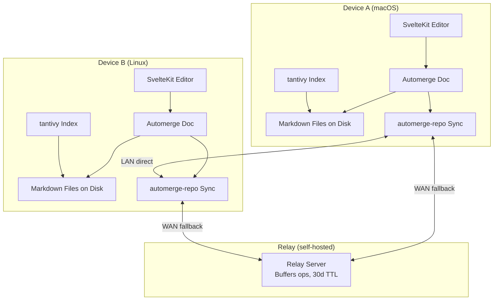

# Local-First Note-Taking App with Peer-to-Peer Sync

## Problem

Existing note-taking apps force a choice: own your data (Obsidian with unreliable iCloud sync) or get reliable sync (Apple Notes with ecosystem lock-in and opaque formats). There's no option that gives you plain Markdown files you control, with sync that just works across devices, without depending on a company's continued existence or pricing decisions.

## Goal

A desktop note-taking app where Markdown files on your machine are the source of truth, and edits sync across your devices automatically using CRDT-based merging with an optional encrypted relay — no vendor lock-in, no data hostage situations.

## Audience

The primary user is a developer who works across multiple machines (macOS and Linux), writes in Markdown, values data ownership, and is willing to self-host a small relay server. They currently use Obsidian and are frustrated by sync limitations. They edit notes daily, often across two or more desktops.

## Scope

### In Scope (v1 — 4-week target)

- Tauri v2 desktop app for macOS and Linux
- Markdown editor with dual-mode: source editing and live preview
- Notes stored as `.md` files in a user-specified local directory
- Flat folder structure with tag-based organization and bidirectional `[[links]]`
- Full-text search powered by tantivy (Rust)
- CRDT-based sync between the user's own devices via automerge-repo
- Self-hostable relay server (single binary or Docker container) that buffers encrypted CRDT operations with a 30-day TTL
- Manual device pairing (configuration-based, no UX flow yet)
- Sync works both directly (LAN) and through the relay (WAN)

### Out of Scope (deferred)

- **Mobile (iOS)** — different platform constraints; revisit after desktop is solid
- **Web version** — not a priority for the target user
- **External file watcher** — detecting edits made by vim, VS Code, etc. and reconciling with CRDT state. Complex, deferred to post-v1. In v1, the app owns the files.
- **QR/pairing-code device onboarding** — v1 uses manual configuration
- **E2E encryption** — depends on automerge-repo's capabilities. If not built in, defer and add as a layer. Relay stores CRDT ops that are effectively opaque but not formally encrypted in v1.
- **Graph view** — link structure supports it, but the visualization is deferred
- **Block editor / Notion-style editing** — not wanted; Markdown source + preview is the model
- **Multi-user collaboration** — this is a personal tool for syncing your own devices

## Design

### How It Works

**Core flow:**
1. User edits a note in the SvelteKit editor
2. Edits are applied to an Automerge CRDT document in Rust (via Tauri commands)
3. The Automerge document is serialized to Markdown and written to disk
4. automerge-repo syncs CRDT operations to connected peers (direct or via relay)
5. On the receiving device, incoming operations are merged into the local Automerge document, and the Markdown file is updated

**Note identity:** Each note has a stable UUID. The filename is a human-friendly label derived from the note title, but the sync layer tracks notes by ID. A metadata sidecar (likely a small SQLite database or JSON file) maps IDs to file paths.

### Key Decisions

- **Tauri v2 over Electron:** The app should feel fast and local. Electron's memory overhead contradicts the project's values. Tauri gives native performance with a web UI.

- **Automerge over Yjs:** Automerge has better Rust support and the automerge-repo abstraction handles sync transport, reducing custom plumbing. Yjs is more mature in the browser but less natural for a Rust backend.

- **automerge-repo as the sync layer:** Collapses CRDT management and sync transport into one library. Avoids building custom P2P networking. Relay support maps to the optional-server model.

- **Markdown files as source of truth (with CRDT backing):** The CRDT document is the operational truth during editing. Markdown files on disk are the durable, portable truth. The app writes CRDT state to .md files after each edit. If the app disappears, the .md files remain.

- **tantivy for search:** Rust-native full-text search. Runs in-process, no external dependencies. Fast enough for tens of thousands of notes.

- **Defer external file watching:** Reconciling external edits with CRDT state is a hard subproblem (whole-file replacement loses edit granularity, conflict detection is complex). In v1, the app owns the files. Users can read them externally but should edit through the app.

- **Defer formal E2E encryption:** automerge-repo may or may not encrypt by default. If not, the relay stores CRDT operations that are binary and opaque but not cryptographically protected. Adding a proper encryption layer (key exchange, device pairing) is important but should not block the v1 sync experience.

### Open Questions

- **automerge-repo Rust maturity:** How complete is the Rust implementation of automerge-repo? If the networking/relay support is JS-only, the architecture needs adjustment — possibly running a thin Node sidecar or switching to iroh for transport with raw Automerge for CRDTs.

- **CRDT-to-Markdown fidelity:** Automerge operates on text sequences. Markdown has structure (headings, lists, links). How much Markdown awareness does the CRDT layer need? Can it treat the document as plain text, or does it need to understand block structure to merge intelligently?

- **Relay protocol:** Does automerge-repo's sync server support buffering for offline devices out of the box, or does that need custom implementation?

- **Metadata sidecar format:** SQLite vs JSON for the note-ID-to-filepath mapping and sync state. SQLite is more robust; JSON is simpler and human-readable.

## Constraints

- **Must be self-hostable.** No dependency on any third-party service for core functionality.
- **Markdown files in a normal folder.** Not a custom binary format. `ls ~/notes` should show `.md` files.
- **macOS and Linux.** Windows is not a constraint for v1.
- **Solo developer.** Architecture decisions should favor simplicity and fewer moving parts over theoretical scalability.
- **Tauri v2, SvelteKit, Rust.** Stack is chosen; technology selection is not open for debate.

## Success Criteria

- Can create, edit, and search Markdown notes in the Tauri app on both macOS and Linux
- Edits made on Device A appear on Device B within 30 seconds when both are online
- Edits made while Device B is offline appear when Device B comes online (via relay buffer)
- Concurrent edits to the same note on two devices merge automatically without data loss (when both edits go through the app)
- Notes directory contains standard `.md` files readable by any text editor
- Self-hosted relay runs as a single Docker container with no external dependencies
- The developer uses this app instead of Obsidian for daily note-taking within 6 weeks of starting

## Risks

| Risk | Likelihood | Impact | Mitigation |
|------|-----------|--------|------------|
| automerge-repo Rust support is immature or missing relay features | Medium | High — forces architecture rework | Spike this first. Spend 2 days building a minimal two-device sync proof-of-concept before committing to the stack. Fallback: iroh for transport + raw Automerge. |
| CRDT-to-Markdown round-tripping introduces subtle formatting bugs | Medium | Medium — user sees garbled Markdown | Use property-based testing: generate random Markdown, round-trip through CRDT, verify output matches. Start with plain text and add Markdown structure awareness incrementally. |
| Scope creep from the full vision delays a usable v1 | High | High — the app never ships | Hold the 4-week MVP boundary. No encryption, no file watcher, no pairing UX, no mobile. Ship something usable and iterate. |
| NAT traversal failures make direct sync unreliable | Medium | Low — relay handles this | The relay is the fallback by design. Direct sync is a nice-to-have optimization, not a requirement. |
| Tauri v2 has rough edges on Linux | Low | Medium — platform-specific bugs | Test on Linux early and often. Don't save Linux testing for the end. |
